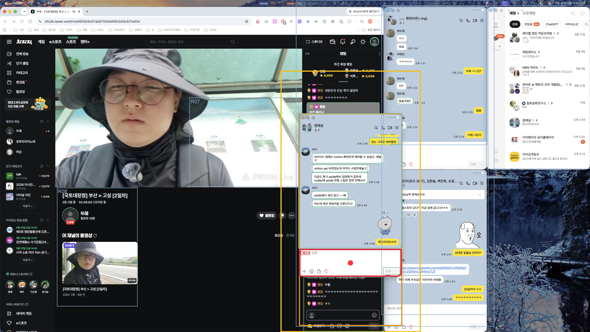

# Jev Retina 창 이동 재검증

실험일: 2026-09-20  
목표: 이동·리사이즈된 카카오톡 `점채널` 방의 메시지 입력 영역 클릭

## 결과

사용자가 임의로 창을 옮기고 크기를 바꾼 뒤, 이전 캡처와 좌표를 사용하지 않고 새 화면부터 다시 실행했다. 새 위치에서도 영역 선택, 입력창 선택, 실제 클릭이 모두 성공했다.

| 항목 | 최초 배치 | 이동 후 배치 |
|---|---:|---:|
| 큰 영역 후보 | 7 | 8 |
| 선택한 방 영역 | `R06` | `R03` |
| 방 선택 확률 | 0.84 | 0.76 |
| 방 선택 confidence | 0.81 | 0.72 |
| 방 존재 확률 | 0.96 | 0.97 |
| 세부 후보 | 9 | 12 |
| 입력 영역 선택 | `D03` | `D03` |
| 입력 선택 확률 | 1.00 | 1.00 |
| 입력 존재 확률 | 0.99 | 0.98 |
| 센서 클릭 좌표 | `(2336, 1380)` | `(1520, 1140)` |

센서 좌표는 `(-816, -240)`만큼 이동했다. 이동 후 좌표를 macOS 전역 좌표 `(-1040, 1140)`으로 변환해 클릭했고, 클릭 뒤 최상단 카카오톡 창이 `점채널`임을 확인했다.

## 실제 새 화면 결과

주황색 `R03`은 Jev가 선택한 이동된 점채널 영역이다. 빨간색 `D03`과 빨간 점은 메시지 입력 마스크와 실제 클릭 위치다.

## 관찰

- 창이 화면 오른쪽 아래에서 중앙으로 이동하고 방송·다른 창과 겹쳤지만 정확한 방 제목을 사용해 다시 찾았다.
- 큰 영역 선택 확률은 0.84에서 0.76으로, confidence는 0.81에서 0.72로 낮아졌다. 겹침과 더 큰 후보 영역 때문에 1단계가 어려워진 것으로 해석된다.
- 입력 영역에는 `메시지 입력 | 전송`이 함께 읽혔지만 Jev는 작성 영역을 확률 1.00으로 선택했다.
- 이전 절대 좌표를 재사용해서 성공한 것이 아니다. 새 캡처에서 FastSAM 마스크 243개, OCR 단어 315개를 다시 만들었다.

## 자료

- [실제 Jev 결과 JSON](assets/attention-point-channel-moved-2026-09-20/result.json)
- [공통 실험 코드](../attention_experiment.py)

원본 캡처는 결과 생성 후 삭제했으며, 사용자가 요청한 실제 화면 오버레이와 구조화 결과만 남겼다.
