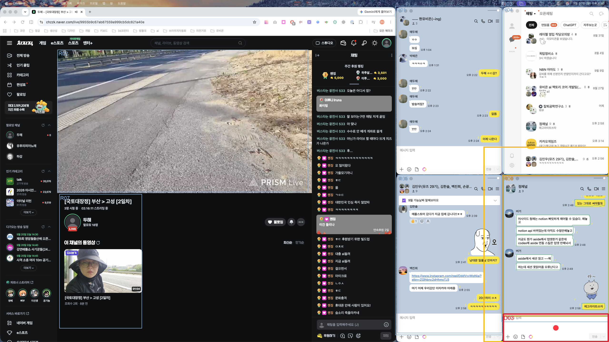

# Jev Retina 목적 기반 시각 탐색 실험

실험일: 2026-09-20  
목표: **카카오톡 `점채널` 대화방의 메시지 입력 영역 클릭**  
장비: Apple M1 Max, 왼쪽 모니터 2560×1440  
모델: FastSAM-s + Apple Vision OCR + Jev 1.13.0

## 결과

두 단계 탐색과 실제 클릭이 모두 성공했다.

| 단계 | 후보 수 | 선택 | 선택 확률 | confidence | 존재 확률 | Jev 지연 |
|---|---:|---|---:|---:|---:|---:|
| 대화방 영역 선택 | 7 | `R06` | 0.84 | 0.81 | 0.96 | 673ms |
| 입력 영역 선택 | 9 | `D03` | **1.00** | **1.00** | **0.99** | 586ms |

- FastSAM 원시 마스크: 243개
- OCR 단어: 427개
- FastSAM 추론: 1.462초
- `R06` 영역: `(2113, 736, 447, 596)`, OCR에서 `점채널`과 대화 내용 확인
- `D03` 영역: `(2113, 1321, 447, 119)`, OCR에서 `메시지 입력` 확인
- 계산된 센서 좌표: `(2336, 1380)`
- macOS 전역 좌표: `(-224, 1380)`
- Quartz 검증: 실제 `점채널` 창의 하단 150px 입력 대역 내부
- 클릭 이후 최상단 카카오톡 창: `점채널`

## 실제 화면 결과

파란색은 1단계 큰 영역 후보, 주황색 `R06`은 Jev가 선택한 점채널 대화 영역이다. 녹색은 2단계 세부 후보, 빨간색 `D03`과 빨간 점은 Jev가 선택한 입력 마스크와 실제 클릭 지점이다.



## 실행 흐름

```text
왼쪽 모니터 캡처
  ↓
FastSAM-s · 243개 마스크
  ↓
크기·직사각형성 필터 · 큰 후보 7개
  ↓
영역별 Apple Vision OCR
  ↓
Jev · 점채널 대화 영역 R06 선택
  ↓
R06 주변 마스크 9개 재후보화
  ↓
Jev · 메시지 입력 D03 선택
  ↓
마스크 중심 (2336, 1380)
  ↓
macOS 전역 좌표 변환 후 클릭
  ↓
최상단 카카오톡 창이 점채널인지 검증
```

## Jev에 전달한 판단 형태

1단계 상태에는 목표, 화면 크기, 각 큰 영역의 좌표·면적·직사각형성·OCR 텍스트를 넣었다. Jev에는 `점채널` 제목과 대화가 함께 있는 가장 작은 자기완결 영역을 선택하고, 방 목록·다른 채팅·방송 화면은 피하라고 요청했다.

Choice의 상위 분포는 다음과 같았다.

| 후보 | 확률 |
|---|---:|
| `R06` | **0.84** |
| `R03` | 0.13 |
| `R01` | 0.02 |
| `R04` | 0.01 |

2단계 상태에는 선택한 대화 영역과 주변 세부 마스크의 좌표·OCR 텍스트를 넣었다. `메시지 입력`이 관찰된 작성 필드를 고르고 말풍선·방 제목·도구 모음·전송 버튼은 피하라고 요청했다. `D03`에 확률 1.00이 집중됐다.

각 단계에서 Choice와 별도로 Noul을 함께 요청해 후보 안에 목표가 실제로 존재하는지도 확인했다. Choice는 항상 하나를 고르므로 존재 검사가 없으면 목표가 없는 화면에서도 가장 가까운 오답을 선택할 수 있다.

## 구현

- [`attention.py`](../attention.py): FastSAM 영역, OCR 연결, 큰 후보·세부 후보 필터, Jev Choice+Noul
- [`attention_experiment.py`](../attention_experiment.py): 두 단계 실험, 좌표 계산, Quartz 검증, 결과 시각화
- [`test_attention.py`](../../tests/test_attention.py): 후보 필터와 JSON 상태 회귀 테스트
- [`result.json`](assets/attention-point-channel-2026-09-20/result.json): 실제 Jev 확률·지연·선택 좌표

## 확인된 장점

- 고정 타일을 Jev에 주지 않아도 FastSAM이 실제 카카오톡 창과 입력 영역을 별도 마스크로 만들었다.
- Jev는 OCR의 정확한 방 제목으로 네 개의 카카오톡 창 중 목표 창을 구분했다.
- 두 번째 판단은 `메시지 입력` 텍스트 때문에 분포가 완전히 집중됐다.
- UI 종류 탐지가 입력창을 놓쳐도 FastSAM 경계와 OCR 조합으로 클릭 영역을 얻었다.

## 제품형 warm 지연시간

FastSAM 모델, MPS 화면 형태, Apple OCR 객체와 TypeSafe HTTP 클라이언트를 유지하고 완전한 파이프라인을 한 번 예열한 뒤 동일 프레임 3회를 측정했다. 아래 수치는 중앙값이다.

| 구간 | 시간 |
|---|---:|
| 화면 캡처 | 0.343초 |
| FastSAM-s | 0.204초 |
| 전체 화면 OCR | **1.803초** |
| 영역 구성 | 0.078초 |
| Jev 1차 영역 선택 | 0.279초 |
| Jev 2차 입력 선택 | 0.290초 |
| 캡처 제외 파이프라인 | **2.665초** |
| 캡처 포함 | **3.008초** |

세 번 모두 같은 입력 영역과 좌표를 선택했다. 현재 병목은 Jev나 FastSAM이 아니라 전체 화면 OCR이다. ScreenCaptureKit의 연속 프레임과 변경 영역 OCR 캐시를 적용하면 캡처와 OCR 비용을 더 줄일 수 있다.

- [warm 측정 원본 JSON](assets/attention-warm-timing-2026-09-20.json)

## 한계와 다음 검증

- 한 프레임, 한 목표에서의 성공이다.
- 큰 후보 면적과 직사각형성 threshold는 현재 휴리스틱이다.
- 캡처와 클릭 사이 화면이 바뀌면 좌표가 오래될 수 있다. 실제 런타임에는 프레임 해시 또는 국소 재확인이 필요하다.
- 같은 방 제목이 방 목록과 열린 창에 동시에 보일 때 작은 자기완결 영역을 선호하는 지시가 필요하다.
- 현재 실험은 macOS 좌측 디스플레이 원점 `(-2560, 0)`을 사용했다. 제품 코드에서는 디스플레이 좌표를 매번 조회해야 한다.
- Windows에서는 화면 캡처, OCR, 전역 좌표 변환을 별도로 검증해야 한다.

실험에 사용한 원본 화면 캡처는 결과 생성 후 삭제했다. 사용자가 요청한 실제 화면 오버레이와 Jev 결과 JSON만 보고서 자산으로 남겼다.
