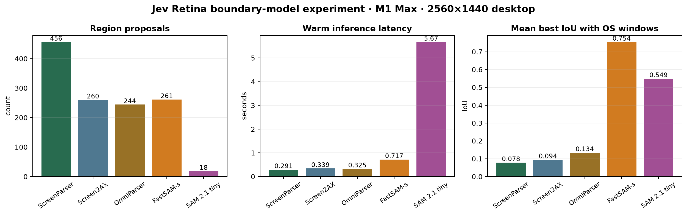
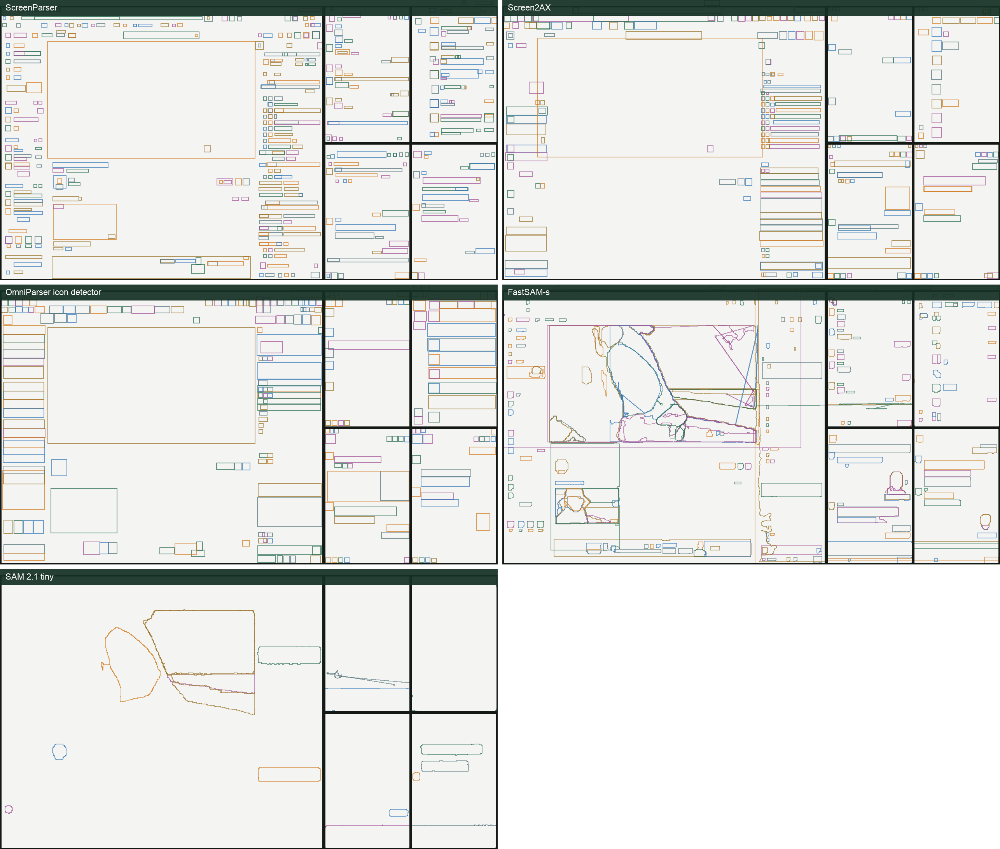
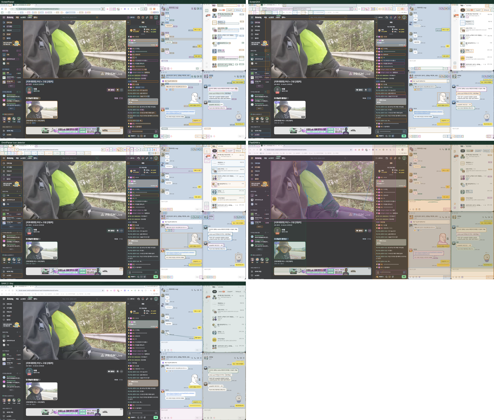
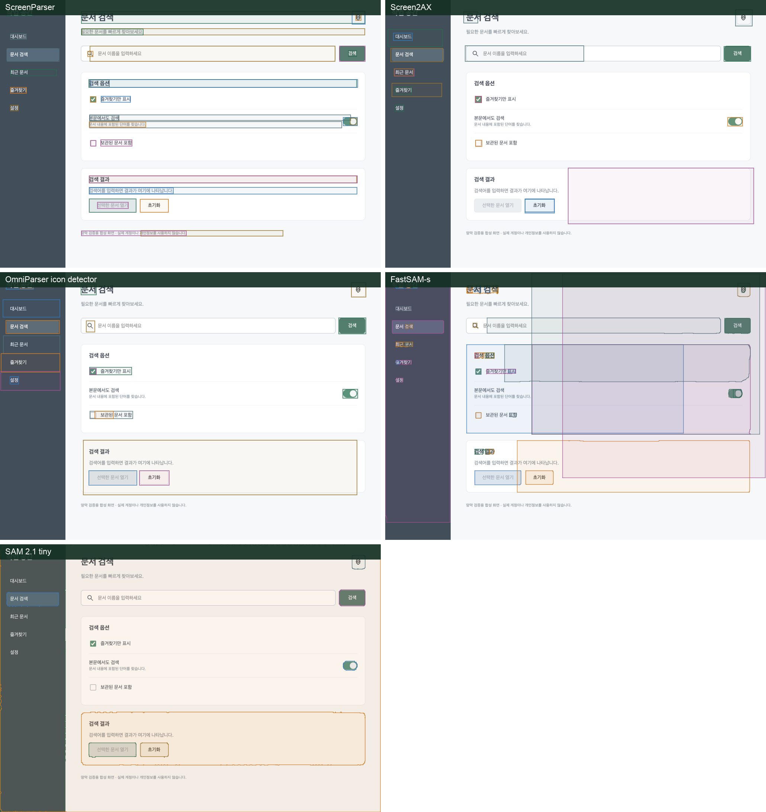

# Jev Retina 화면 경계 모델 실험 보고서

실험일: 2026-09-20  
장비: Apple M1 Max, 64 GB  
입력: 실제 왼쪽 모니터 2560×1440, 합성 UI 1280×900  
실행 환경: PyTorch 2.14.0, Ultralytics 8.4.155, MPS

## 결론

현재 내려받아 실행할 수 있는 모델 중에서는 **FastSAM-s가 1차 화면 분할 후보로 가장 적합하다.** 실제 모니터에 있던 Chrome 창 하나와 카카오톡 창 네 개를 기준으로, FastSAM-s는 5개 창 중 4개를 IoU 0.5 이상으로 맞췄고 warm inference는 0.717초였다.

그러나 FastSAM-s를 단독 분할기로 채택하면 안 된다. 화면 면적의 86.6%를 어떤 마스크로든 덮었고, 서로 다른 OS 창을 함께 가로지르는 마스크가 5개 발생했다. 따라서 다음 구조가 적절하다.

```text
FastSAM-s: 큰 패널·창 경계 후보
ScreenParser: 버튼·입력창·글자 등 의미 요소와 절단 금지 영역
일반 코드: 후보 필터링·중복 제거·안전 분리선 계산
겹침 타일: 경계를 확정하지 못했을 때의 fallback
Jev: 현재 목적과 가장 관련 있는 분할 선택
```

새 모델을 바로 학습하기보다 이 조합으로 실제 화면 집합을 먼저 평가하는 편이 낫다.

## 실험 질문

고정 겹침 타일을 줄이거나 대체할 수 있도록, 공개된 기존 모델이 다음 조건을 만족하는지 확인했다.

1. UI 요소 내부가 아니라 창·패널 단위의 큰 경계를 찾는가?
2. 서로 다른 창을 하나의 영역으로 합치지 않는가?
3. M1 Max에서 반복 실행 가능한 지연시간인가?
4. 작은 버튼 탐지 모델과 상호 보완적인가?

## 비교 대상

| 모델 | 출력 | 실험에서 기대한 역할 |
|---|---|---|
| ScreenParser | 55종 UI 요소 박스 | 현재 기준선, 절단 금지 요소 |
| Screen2AX | 접근성 역할 기반 UI 요소 박스 | 네이티브 UI 요소 후보 |
| OmniParser icon detector | 아이콘·조작 영역 박스 | 작은 상호작용 요소 후보 |
| FastSAM-s | 범용 인스턴스 마스크 | 큰 패널·창 경계 후보 |
| SAM 2.1 tiny | 범용 인스턴스 마스크 | 정밀 경계 후보 |

ScreenSeg는 논문상 가장 직접적인 스크린샷 계층 분할 모델이지만, 검증 가능한 공개 가중치나 실행 구현을 찾지 못해 이번 실행 비교에서 제외했다. UIED와 DCGen은 유용한 공개 기준선이지만 학습된 경계 모델이 아니므로 별도 후속 실험 대상으로 남겼다.

## 실험 방법

실제 화면에는 Chrome 방송 창 한 개와 카카오톡 창 네 개가 있었다. macOS Quartz가 제공하는 화면상 창 좌표를 고수준 경계 정답으로 사용했다. 이 좌표는 평가에만 사용했고 모델 입력에는 전달하지 않았다.

각 모델은 합성 화면으로 한 번 warm-up한 다음 동일한 실제 모니터 캡처를 분석했다. 지연시간은 결과 박스 또는 마스크를 CPU 좌표로 변환하는 시간까지 포함한다.

원본 캡처 파일은 실험 후 삭제했다. 사용자의 명시적인 요청에 따라 실제 픽셀 위에 모델 출력을 그린 오버레이 이미지는 보고서 자산으로 보관한다. 검은 굵은 사각형만 있는 별도 지도에서는 Quartz 창 경계를 정답으로 표시했다.

## 정량 결과

| 모델 | 영역 수 | 추론 시간 | 면적 커버리지 | 작은 영역 | 큰 영역 | 평균 창 IoU | IoU≥0.5 창 | 창을 가로지른 영역 |
|---|---:|---:|---:|---:|---:|---:|---:|---:|
| ScreenParser | 456 | **0.291초** | 45.9% | 414 | 1 | 0.078 | 0/5 | 0 |
| Screen2AX | 260 | 0.339초 | 42.8% | 202 | 1 | 0.094 | 0/5 | 0 |
| OmniParser icon detector | 244 | 0.325초 | 52.7% | 183 | 1 | 0.134 | 0/5 | 0 |
| **FastSAM-s** | 261 | **0.717초** | 86.6% | 183 | 15 | **0.754** | **4/5** | 5 |
| SAM 2.1 tiny | 18 | 5.666초 | 30.7% | 3 | 4 | 0.549 | 2/5 | 1 |

`평균 창 IoU`는 각 실제 OS 창과 가장 잘 맞는 모델 영역의 IoU를 평균한 값이다. `창을 가로지른 영역`은 한 모델 영역 면적의 15% 이상이 서로 다른 실제 창 두 개 이상에 걸친 경우다. 큰 영역은 전체 화면의 5% 초과, 작은 영역은 0.1% 미만으로 정의했다.



## 실제 모니터 경계 비교



아래는 **실제 모니터 픽셀 위에 모델이 반환한 영역을 그대로 겹친 비교**다. UI 탐지 모델은 사각 박스, FastSAM과 SAM 2.1은 실제 마스크 윤곽과 반투명 마스크를 표시한다.



원본 해상도 결과:

- [ScreenParser 실제 박스](assets/boundary-model-2026-09-20/actual-screen/screenparser.png)
- [Screen2AX 실제 박스](assets/boundary-model-2026-09-20/actual-screen/screen2ax.png)
- [OmniParser 실제 박스](assets/boundary-model-2026-09-20/actual-screen/omniparser-icon-detector.png)
- [FastSAM-s 실제 마스크](assets/boundary-model-2026-09-20/actual-screen/fastsam-s.png)
- [SAM 2.1 tiny 실제 마스크](assets/boundary-model-2026-09-20/actual-screen/sam-2-1-tiny.png)

### ScreenParser

버튼, 텍스트, 입력창처럼 작은 요소를 가장 촘촘하게 찾았다. 456개 중 414개가 화면 면적 0.1% 미만이었다. 큰 방송 영상 하나는 잡았지만 OS 창이나 패널 경계는 거의 제안하지 않았다. **의미 요소 센서에는 적합하지만 1차 화면 분할기에는 부적합하다.**

### Screen2AX

ScreenParser보다 출력은 적지만 큰 레이아웃 경계를 찾지 못했다. 실제 창 평균 IoU는 0.094였다. 네이티브 역할 분류를 보조하는 용도는 가능하지만 분할선 생성에는 도움이 작다.

### OmniParser icon detector

아이콘과 상호작용 후보뿐 아니라 일부 큰 영역도 박스로 묶었지만 창 경계 재현은 낮았다. 아이콘 탐지 모델을 화면 분할에 재사용하는 것은 맞지 않는다.

### FastSAM-s

실제 창 경계와 가장 가까운 마스크를 생성했다. Chrome과 카카오톡 창 배치를 시각적으로 가장 잘 복원했고 0.717초로 반복 분석이 가능한 범위였다. 방송 영상 내부도 세밀하게 분할했다.

단점은 과분할과 과병합이 동시에 있다는 점이다. 261개 마스크가 화면의 86.6%를 덮었고 서로 다른 창을 함께 가로지른 마스크가 5개였다. 다음 필터가 필요하다.

- 화면 축에 정렬된 큰 직사각형 우선
- 지나치게 가늘거나 복잡한 마스크 제외
- ScreenParser 요소를 가르는 경계 제외
- 포함 관계가 큰 마스크끼리 계층화
- 확신할 수 없는 곳은 기존 겹침 타일 유지

### SAM 2.1 tiny

18개 마스크만 출력해 시각적으로 깔끔했고 일부 카드·창 경계는 잘 맞았다. 하지만 다섯 창 중 두 개만 IoU 0.5를 넘었고 5.666초가 걸렸다. 현재 실시간 망막의 1차 단계로는 느리고 누락이 크다. 사용한다면 Jev가 선택한 한 ROI의 2차 경계 보정용이 적합하다.

## 합성 UI 확대 비교

아래 그림은 동일한 개인정보 없는 합성 UI 위에 각 모델 결과를 직접 겹친 것이다.



- UI 전용 세 모델은 버튼·입력창·텍스트 단위로 나뉜다.
- FastSAM-s는 사이드바와 카드 같은 큰 시각 블록을 찾지만 서로 겹치는 큰 마스크가 많다.
- SAM 2.1 tiny는 사이드바와 큰 카드 경계가 깨끗하지만 작은 UI를 대부분 생략한다.

이 차이는 두 종류의 모델을 결합해야 하는 이유를 보여준다. 분할 모델은 큰 시각 구조를 제안하고 UI 탐지기는 그 경계가 중요한 요소를 절단하는지 검사해야 한다.

## 권고안

### 즉시 채택할 실험 구성

1. 전체 화면을 축소해 FastSAM-s를 한 번 실행한다.
2. 큰 마스크에서 직사각형성, 축 정렬, 면적, 포함 관계를 계산한다.
3. ScreenParser 박스와 OCR 글자 박스를 절단하는 후보를 제외한다.
4. 남은 경계로 계층적 ROI를 만든다.
5. Jev가 목적에 맞는 ROI를 고른다.
6. 선택 ROI를 주변 여백과 함께 원본 해상도로 재분석한다.
7. 안전한 경계가 없으면 현재 겹침 타일로 돌아간다.

### 새 모델 학습 여부를 결정할 조건

최소 30~100개의 실제 macOS·Windows 화면으로 다음을 측정한다.

- 중요한 요소가 경계에 잘린 비율
- 목적 관련 영역이 후보에 포함되는 비율
- 창·패널 경계 IoU
- 후보 수와 전체 처리시간
- 방송·채팅·IDE·설정·파일관리자별 실패율

하이브리드 방식의 경계 절단률이 허용 수준에 미달할 때만 PixelWeb과 네이티브 화면 라벨로 작은 `safe-cut` 모델을 학습한다. 학습 목표는 모든 객체 마스크가 아니라 각 가로·세로 좌표의 안전한 절단 확률이어야 한다.

## 한계

- 실제 화면 한 장과 합성 화면 한 장으로 수행한 초기 비교다.
- Quartz 창 좌표는 고수준 분할 정답이며 내부 패널 정답은 아니다.
- 방송 영상의 내용은 캡처 시점마다 달라진다.
- FastSAM과 SAM의 threshold 탐색을 아직 하지 않았다.
- 모델별 기본 해상도가 달라 완전히 동일한 연산량 비교는 아니다.
- Windows 실기기 결과는 포함하지 않았다.

## 재현 자료

- 실행 스크립트: [`eye/benchmarks/boundary_models.py`](../benchmarks/boundary_models.py)
- 수치 결과: [`results.json`](assets/boundary-model-2026-09-20/results.json)
- FastSAM-s SHA-256: `c9f78716a81c7aff0d608ccc73e1b82ab3aaad86005049f6a92106a0be6d0844`
- SAM 2.1 tiny SHA-256: `3c1e81ca9b037dd39d70a014ddb9a813d6c4c4e12555420db7eaff31689bd4e3`
- OmniParser detector SHA-256: `dab3d4351ad00b035db829909a4db98354d5a90f6990e4ac00222a9a95d4bf57`

가중치는 `eye/models/`에 있으며 프로젝트의 기존 ignore 규칙에 따라 Git에는 포함되지 않는다.

## 참고 자료

- [ScreenSeg: On-Device Screenshot Layout Analysis](https://arxiv.org/abs/2104.08052)
- [ScreenParser 모델 카드](https://huggingface.co/docling-project/ScreenParser)
- [Screen2AX UI 요소 탐지 모델](https://huggingface.co/macpaw-research/yolov11l-ui-elements-detection)
- [Microsoft OmniParser](https://github.com/microsoft/OmniParser)
- [FastSAM 공식 구현](https://github.com/CASIA-IVA-Lab/FastSAM)
- [Meta SAM 2 공식 구현](https://github.com/facebookresearch/sam2)
