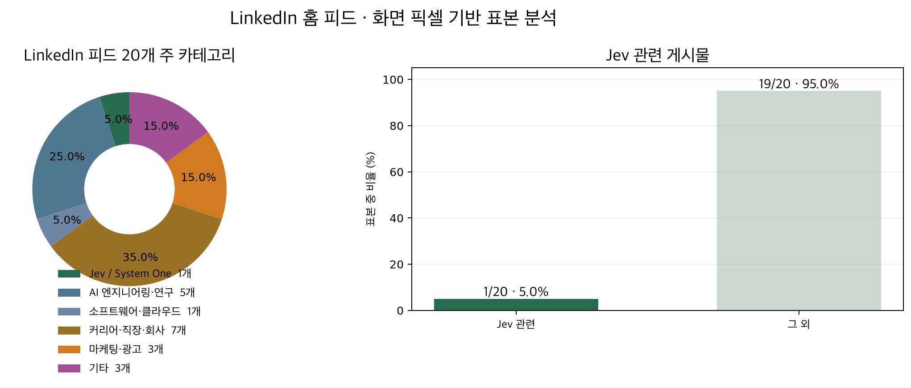
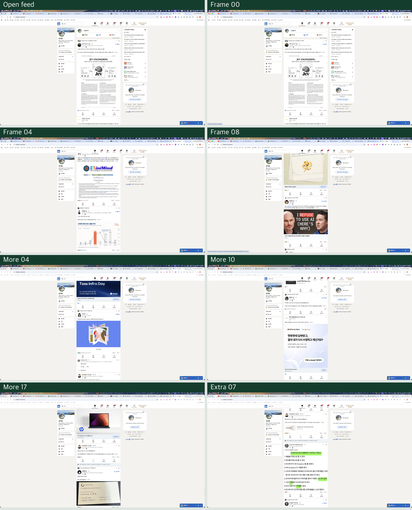

# LinkedIn 홈 피드 화면 픽셀 분석

실험일: 2026-09-20  
범위: 로그인된 LinkedIn 홈 추천 피드에서 화면 순서상 처음 확보한 유효 게시물 20개  
입력: 실제 디스플레이 픽셀  
모델: FastSAM-s + Apple Vision OCR + Jev 1.13.0

## 결과

| 주 카테고리 | 개수 | 비율 |
|---|---:|---:|
| 커리어·직장·회사 소식 | 7 | **35.0%** |
| AI 엔지니어링·연구 | 5 | **25.0%** |
| 마케팅·광고 | 3 | 15.0% |
| 기타 | 3 | 15.0% |
| Jev / System One | 1 | 5.0% |
| 소프트웨어·클라우드 개발 | 1 | 5.0% |
| 합계 | 20 | 100.0% |

Jev 관련 게시물은 1개, 표본의 **5.0%**였다. 화면에서 가장 먼저 보인 게시물의 제목은 `LLM의 시대가 가고 JEV의 시대가 온다!`였고 Jev 관련 Noul은 0.89였다.



## 실제 화면 탐색

아래 접촉 시트는 브라우저 내부 데이터가 아니라 OS 휠로 이동하면서 캡처한 실제 모니터 프레임이다.



## 실행 흐름

```text
오른쪽 모니터 캡처
  ↓
Chrome 탭 바의 + 버튼을 픽셀 좌표로 클릭
  ↓
OS 붙여넣기·키 입력으로 LinkedIn 검색
  ↓
검색 결과의 LinkedIn 제목을 OCR 좌표로 클릭
  ↓
Premium 모달에 OS Escape 입력
  ↓
FastSAM으로 가운데 흰 게시물 카드 후보 생성
  ↓
Apple Vision OCR로 후보마다 화면 텍스트 추출
  ↓
콘텐츠 열 중앙에서 OS 휠 +500px 반복
  ↓
로컬 텍스트 유사도로 반복 관찰 병합
  ↓
Jev가 독립 게시물 카드 여부·주제·Jev 관련성을 판정
```

DOM, CDP, Playwright, ego-browser, 접근성 트리, LinkedIn API는 사용하지 않았다.

## 후보 정리

- 실제 피드 프레임: 초기 11장 + 추가 18장 + 보충 8장
- FastSAM/OCR 원시 영역: 116개
- 크기·직사각형성·텍스트 조건과 로컬 유사도로 줄인 후보: 40개
- Jev가 독립 게시물 카드라고 판정한 후보: 22개
- 중복 제거 후 고유 게시물: 20개

Jev의 게시물 유효성 Noul은 프로필 조회자 위젯, 카드 내부 이미지, 반응 버튼 행, 댓글, 여러 게시물을 한꺼번에 감싼 마스크를 제외하는 데 사용했다.

## 분류된 게시물

| ID | 내용 요약 | 게시물 확률 | 카테고리 | category confidence | Jev 확률 |
|---|---|---:|---|---:|---:|
| C01 | LLM 시대와 JEV Engineering | 0.86 | Jev / System One | 0.94 | **0.89** |
| C02 | 카카오 if(kakao)26 행사 | 0.84 | 커리어·직장·회사 | 0.59 | 0.05 |
| C03 | MiniMind LLM 학습 프로젝트 | 0.63 | AI 엔지니어링·연구 | 1.00 | 0.03 |
| C05 | Van Cleef 브랜드 콘텐츠 | 0.87 | 마케팅·광고 | 0.98 | 0.02 |
| C10 | 개발자에서 시스템 엔지니어로 전환 | 0.88 | 커리어·직장·회사 | 0.53 | 0.04 |
| C11 | 개발 관련 강의·도구 소개 | 0.62 | AI 엔지니어링·연구 | 0.53 | 0.03 |
| C12 | GPT Work + Computer Use 활용 | 0.79 | AI 엔지니어링·연구 | 0.74 | 0.03 |
| C14 | Toss Infra Day·이직 소식 | 0.56 | 커리어·직장·회사 | 1.00 | 0.03 |
| C17 | AI 연구자 퇴사 논쟁 | 0.57 | AI 엔지니어링·연구 | **0.42** | 0.08 |
| C18 | 토스 신규 입사자 3개월 후기 | 0.90 | 커리어·직장·회사 | 1.00 | 0.02 |
| C19 | 카카오뱅크 알림 발송 플랫폼 | 0.93 | 소프트웨어·클라우드 | 0.87 | 0.02 |
| C20 | Claude와 OpenAI 관련 연구 | 0.87 | AI 엔지니어링·연구 | 0.98 | 0.04 |
| C21 | Bespin Global AI 광고 | 0.92 | 마케팅·광고 | 0.98 | 0.03 |
| C23 | Threads 글로 첫 매출 | 0.86 | 기타 | 0.69 | 0.03 |
| C24 | AI 인플루언서 라이브 방송 | 0.68 | 기타 | **0.34** | 0.04 |
| C25 | AI 인플루언서 실험 | 0.85 | 기타 | **0.43** | 0.05 |
| C26 | HP AI PC 광고 | 0.87 | 마케팅·광고 | 1.00 | 0.04 |
| N02 | 우아한형제들 AI 전환 기술블로그 | 0.89 | 커리어·직장·회사 | 0.52 | 0.02 |
| N06 | AI Application Engineer 이직 | **0.50** | 커리어·직장·회사 | 1.00 | 0.02 |
| N07 | HR 영향력에 관한 글 | 0.90 | 커리어·직장·회사 | 1.00 | 0.02 |

## 해석상 주의점

- LinkedIn 홈은 무한 추천 피드다. 이 비율은 계정 전체나 LinkedIn 전체가 아니라 **현재 추천 피드 앞 20개 표본**에만 해당한다.
- C17, C24, C25는 OCR 문장이 불완전해 category confidence가 낮다.
- N06은 독립 게시물 확률이 정확히 0.50이므로 표본 포함 여부가 경계선이다.
- 한 카드가 여러 프레임에 걸쳐 나타나므로 화면 텍스트 유사도로 병합했다.
- 화면 OCR 오류를 고려하라고 Jev에 명시했지만 잘못된 주제 판단 가능성은 남는다.

## Jev 실행

FastSAM/OCR 후보를 40개로 줄인 뒤 두 차례의 Jev fan-out 요청으로 신규 후보를 보충했다.

- 총 Jev 지연: 2.041초
- 입력 토큰: 24,586
- 출력 토큰: 4,849

## 재현 자료

- [초기 FastSAM/OCR 트랙](assets/linkedin-feed-stats-2026-09-20/pixel-posts.json)
- [추가 픽셀 영역](assets/linkedin-feed-stats-2026-09-20/more-regions.json)
- [Jev 유효성·카테고리·관련성 결과](assets/linkedin-feed-stats-2026-09-20/classification.json)

임시 원본 화면 프레임은 접촉 시트 생성과 결과 검증 후 삭제했다.
