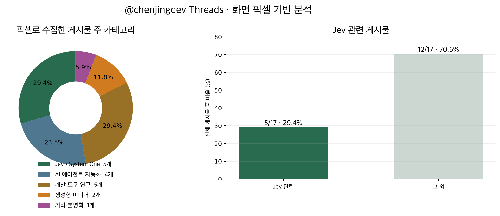
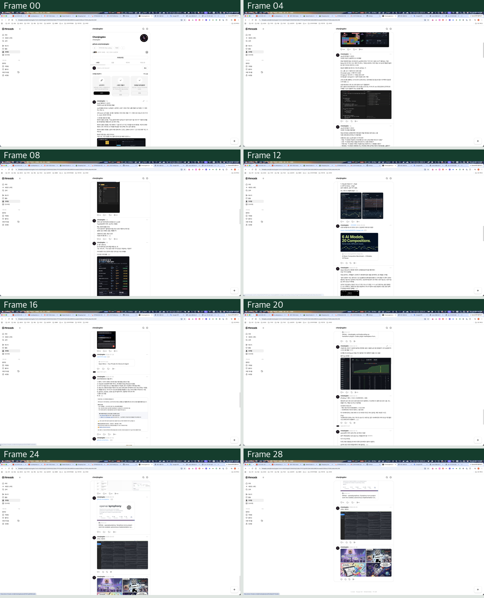

# @chenjingdev Threads 화면 픽셀 기반 통계

수집일: 2026-09-20  
범위: 실제 모니터에 표시된 프로필 `스레드` 탭  
입력: 디스플레이 픽셀만 사용  
분류: Jev 1.13.0

## 결과

**화면에서 복원한 게시물 17개 중 Jev 관련은 5개, 29.4%다.**

| 주 카테고리 | 개수 | 비율 |
|---|---:|---:|
| Jev / System One 실험 | 5 | **29.4%** |
| 개발 도구·코딩 연구 | 5 | **29.4%** |
| AI 에이전트·자동화 | 4 | 23.5% |
| 생성형 음악·미디어 | 2 | 11.8% |
| 기타·불명확 | 1 | 5.9% |
| 합계 | 17 | 100.0% |

Jev, 개발 도구·연구, AI 에이전트·자동화를 합치면 14개로 **82.4%**다.



## 실제 화면 탐색 과정

아래 이미지는 DOM이나 브라우저 API에서 만든 것이 아니라, OS 휠로 350px씩 이동하면서 저장한 실제 디스플레이 프레임의 일부다.



## 사용한 시각 경로

```text
세 모니터 캡처
  ↓
Apple Vision OCR로 Chrome 탭 바의 “Threads” 탐지
  ↓
OCR 좌표에 macOS 마우스 클릭
  ↓
새 캡처에서 Threads 화면 확인
  ↓
OCR로 왼쪽 메뉴의 “프로필” 탐지 후 좌표 클릭
  ↓
프로필 화면에서 chenjingdev 텍스트로 콘텐츠 열 x=947…1667 추정
  ↓
OS 휠 +350px → 캡처 → OCR 반복
  ↓
작성자 헤더·날짜·본문을 y 좌표와 프레임 간 350px 이동으로 추적
  ↓
화면 픽셀 차이가 3회 연속 임계값 아래면 종료
  ↓
복원한 17개 OCR 블록만 Jev에 전달
```

브라우저 DOM, CDP, Playwright, ego-browser, 접근성 트리, 게시물 URL은 사용하지 않았다.

## 수집 수치

- 화면 캡처 프레임: 29장
- 실제 휠 간격: 350px
- OCR 콘텐츠 열: `(947, 0) ~ (1667, 1440)`
- 복원 게시물: 17개
- 종료 조건: 320×180 축소 프레임의 평균 픽셀 차이가 0.5 미만으로 3회 연속 유지
- OCR: Apple Vision `ko-KR`, `en-US`

긴 게시물은 여러 프레임에서 관찰됐다. 같은 작성자 헤더가 정확히 350px 이동하고 본문 단어가 겹치면 같은 게시물로 합쳤다. Open Minis 본문과 링크처럼 날짜가 같아도 본문이 겹치지 않으면 별도 게시물로 유지했다. 화면이 정지한 뒤 OCR 철자가 달라져 새 헤더처럼 보이는 경우는 중복으로 제외했다.

## Jev 분류

17개 OCR 블록을 하나의 구조화 상태로 전달하고, 각 블록마다 다음 두 질문을 병렬로 실행했다.

- Choice: 다섯 주 카테고리 중 주제가 무엇인가?
- Noul: TypeSafe Jev/System One 또는 Jev를 핵심 메커니즘으로 사용한 실험인가?

Jev 요청은 0.896초, 입력 12,343토큰, 출력 1,480토큰이었다. Noul 0.5 이상을 Jev 관련으로 집계했다.

## 게시물별 판단

| 픽셀 ID | 화면의 날짜 표기 | 주 카테고리 | category confidence | Jev 확률 |
|---|---|---|---:|---:|
| P01 | 1일 | Jev / System One | 1.00 | 0.94 |
| P02 | 1일 | Jev / System One | 0.93 | 0.94 |
| P03 | 1일 | Jev / System One | 1.00 | 0.93 |
| P04 | 3일 | Jev / System One | 0.99 | 0.91 |
| P05 | 3일 | Jev / System One | 0.98 | 0.91 |
| P06 | 2026-09-06 | 생성형 미디어 | 1.00 | 0.05 |
| P07 | 2026-09-06 | 생성형 미디어 | 1.00 | 0.05 |
| P08 | 2026-07-28 | AI 에이전트·자동화 | 1.00 | 0.06 |
| P09 | 2026-07-28¹ | AI 에이전트·자동화 | 0.99 | 0.06 |
| P10 | 2026-07-16 | 개발 도구·연구 | 0.74 | 0.04 |
| P11 | 2026-07-16¹ | 개발 도구·연구 | 0.97 | 0.05 |
| P12 | 2026-04-12 | 개발 도구·연구 | 1.00 | 0.05 |
| P13 | 2026-04-12¹ | 개발 도구·연구 | 1.00 | 0.04 |
| P14 | 2026-03-14 | AI 에이전트·자동화 | 0.96 | 0.05 |
| P15 | 2026-03-14¹ | AI 에이전트·자동화 | 0.96 | 0.04 |
| P16 | 2026-03-03 | 개발 도구·연구 | **0.29** | 0.10 |
| P17 | 2026-02-06 | 기타·불명확 | **0.39** | 0.06 |

¹ OCR이 연도 또는 월 숫자를 일부 잘못 읽었지만 인접 게시물의 화면 위치와 나머지 날짜가 일치했다. 카테고리는 날짜가 아니라 본문으로 판단했다.

P16과 P17은 화면에 텍스트가 거의 없거나 이미지 중심이라 category confidence가 낮다. 이 둘의 카테고리 비율은 잠정값으로 봐야 한다. Jev 관련 5개는 모두 0.91 이상이었다.

## 무효 처리한 이전 결과

이 보고서 이전에 만든 통계는 ego-browser DOM snapshot과 `querySelector()`를 사용했기 때문에 Jev Retina의 시각 실험으로는 무효 처리했다. 해당 DOM 기반 게시물·분류 JSON은 삭제했으며 이 보고서와 차트는 픽셀 기반 데이터로 교체했다.

## 재현 자료

- [픽셀 OCR 게시물 블록](assets/threads-stats-2026-09-20/pixel-posts.json)
- [Jev 분류와 확률](assets/threads-stats-2026-09-20/pixel-classification.json)

분류를 위해 화면 OCR 텍스트를 TypeSafe Jev에 전달했다. 임시 원본 캡처 프레임은 검증 이미지 생성 후 삭제했다.
